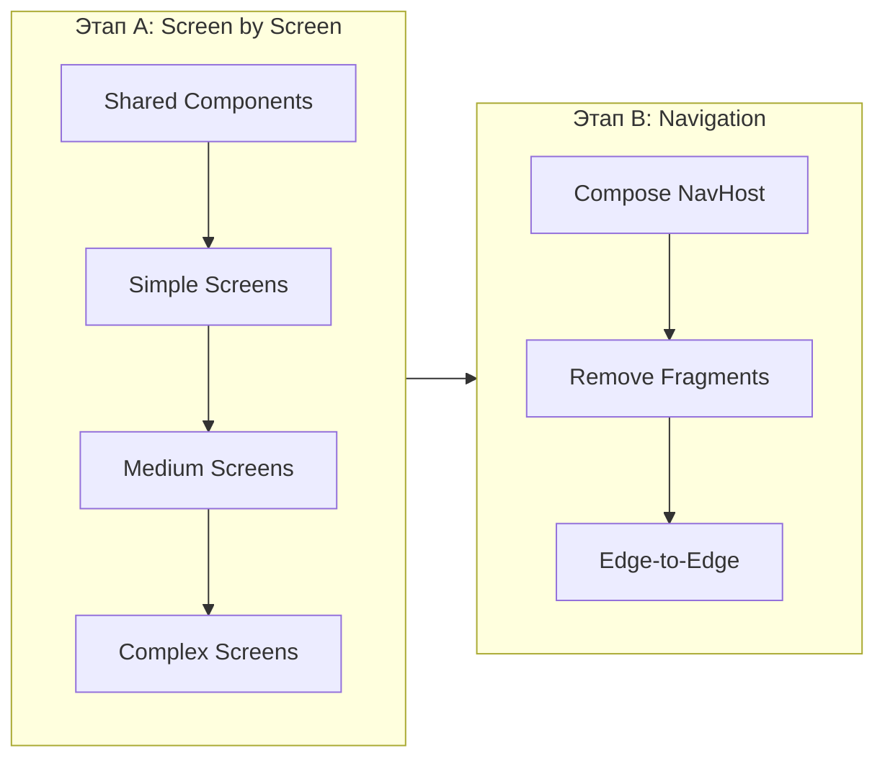

# Фаза 2.2: Полная миграция UI на Jetpack Compose

## Стратегия миграции

Используем **двухэтапный подход**:

1. **Этап A** — Создать Compose-экраны и подключить их через `ComposeView` внутри существующих фрагментов. Навигация через XML `nav_graph.xml` продолжает работать. Приложение остается рабочим после каждого экрана.
2. **Этап B** — Когда все экраны на Compose, заменить `NavHostFragment` на Compose `NavHost` с type-safe routes. Удалить фрагменты и `nav_graph.xml`.




---

## 0. Подготовка и зависимости

**Файл:** [app/build.gradle](app/build.gradle)

- Добавить `androidx.navigation:navigation-compose:2.9.7` (сейчас отсутствует, нужен для Этапа B)
- Убедиться что `coil-compose` есть (для замены Glide в GoalAdapter)
- Подтвердить наличие: Compose BOM `2026.03.00`, `hilt-navigation-compose:1.2.0`, Material3 -- уже есть

**Файл:** [app/src/main/java/com/breckneck/debtbook/core/ui/theme/](app/src/main/java/com/breckneck/debtbook/core/ui/theme/)

- `Theme.kt`, `Color.kt`, `Type.kt`, `Shape.kt` -- уже существуют, используются в `AuthorizationScreen`

---

## 1. Shared Compose компоненты (создать перед экранами)

Создать пакет `app/src/main/java/com/breckneck/debtbook/core/ui/components/` с переиспользуемыми компонентами:

- `**DebtBookTopBar.kt`** -- общий TopAppBar с back-кнопкой, заголовком, опциональными action-иконками (sort, search, settings). Используется практически во всех экранах.
- `**SettingsPickerBottomSheet.kt`** -- Compose `ModalBottomSheet` с `LazyColumn` + `RadioButton` для выбора из списка (замена `dialog_setting.xml` + `SettingsAdapter`). Используется в: NewDebt (валюта), CreateGoals (валюта), Finance (валюта, интервал), Settings (валюта x3, тема).
- `**ConfirmationBottomSheet.kt`** -- Compose `ModalBottomSheet` с текстом + кнопками (замена `dialog_are_you_sure.xml`). Используется в: DebtDetails, CreateFinance, Synchronization.
- `**ExtraFunctionsBottomSheet.kt`** -- Compose `ModalBottomSheet` с опциями "Редактировать / Удалить / Отмена" (замена `dialog_extra_functions.xml`). Используется в: DebtDetails, FinanceDetails, GoalDetails.
- `**SortFilterBottomSheet.kt`** -- Compose `ModalBottomSheet` с RadioGroup для сортировки/фильтрации (замена `dialog_sort.xml`). Используется в: MainFragment, DebtDetails.
- `**EmptyListPlaceholder.kt`** -- заглушка для пустых списков (shimmer-эффект + empty state).
- `**AdBannerComposable.kt`** -- обертка для Yandex Ads баннера через `AndroidView`.

---

## 2. Порядок миграции экранов (от простого к сложному)

### Группа 1: Simple (1 экран)

#### 2.1 `CreateFinanceCategoryFragment` -> `CreateFinanceCategoryScreen`

- **Сложность:** Simple (~163 строк, 0 диалогов)
- **Текущий фрагмент:** [CreateFinanceCategoryFragment.kt](app/src/main/java/com/breckneck/debtbook/finance/presentation/CreateFinanceCategoryFragment.kt)
- **ViewModel:** `CreateFinanceCategoryViewModel` (LiveData: checkedImage, checkedColor, checkedImagePosition, checkedColorPosition, financeCategoryState)
- **Что делать:**
  - `LazyVerticalGrid` для иконок (замена `FinanceCategoryImageAdapter`)
  - `LazyVerticalGrid` для цветов (замена `FinanceCategoryColorAdapter`)
  - `OutlinedTextField` для имени категории
  - `FloatingActionButton` для сохранения
- **Навигация:** получает `categoryState` из arguments; возвращает `isListModified` + `categoryState` через `setFragmentResult`

---

### Группа 2: Medium (4 экрана)

#### 2.2 `FinanceDetailsFragment` -> `FinanceDetailsScreen`

- **Сложность:** Medium (~220 строк, 1 bottom sheet)
- **Текущий фрагмент:** [FinanceDetailsFragment.kt](app/src/main/java/com/breckneck/debtbook/finance/presentation/FinanceDetailsFragment.kt)
- **ViewModel:** `FinanceDetailsViewModel` (LiveData: financeList, settingsDialogOpened, settingsFinance, categoryName/Id, isExpenses, financeListState)
- **Что делать:**
  - `LazyColumn` для списка финансов (замена `FinanceAdapter`)
  - `ExtraFunctionsBottomSheet` для редактирования/удаления
  - TopAppBar с названием категории
- **Навигация:** получает `categoryName`, `categoryId`, `currency`, `isExpenses`; переходит на `CreateFinanceFragment` для редактирования

#### 2.3 `GoalsFragment` -> `GoalsScreen`

- **Сложность:** Medium (~231 строк, 1 bottom sheet)
- **Текущий фрагмент:** [GoalsFragment.kt](app/src/main/java/com/breckneck/debtbook/goal/presentation/GoalsFragment.kt)
- **ViewModel:** `GoalsFragmentViewModel` (LiveData: goalList, goalListState; vars: isAddSumDialogOpened, changedGoal, changedGoalPosition)
- **Что делать:**
  - `LazyColumn` для списка целей (замена `GoalAdapter` -- самый сложный адаптер, ~15 views per item, Glide для картинок, кнопки Add/Delete)
  - Заменить Glide на `AsyncImage` (Coil)
  - `ModalBottomSheet` для ввода суммы добавления (замена `dialog_add_goal_sum.xml`)
  - FAB для создания цели
  - Shimmer / Empty state

#### 2.4 `CreateGoalsFragment` -> `CreateGoalsScreen`

- **Сложность:** Medium (~436 строк, 1 bottom sheet + DatePicker)
- **Текущий фрагмент:** [CreateGoalsFragment.kt](app/src/main/java/com/breckneck/debtbook/goal/presentation/CreateGoalsFragment.kt)
- **ViewModel:** `CreateGoalsFragmentViewModel` (LiveData: goalDate, selectedCurrencyPosition, isCurrencyDialogOpened, currency, imageUri, imagePath, + vars: createFragmentState, goal)
- **Что делать:**
  - Форма: `OutlinedTextField` x3 (название, сумма, сохраненная сумма)
  - `SettingsPickerBottomSheet` для валюты
  - `DatePickerDialog` (Compose Material3)
  - Выбор фото: `rememberLauncherForActivityResult` + `AsyncImage`
  - FAB для сохранения с валидацией
  - Режим создания / редактирования

#### 2.5 `CreateFinanceFragment` -> `CreateFinanceScreen`

- **Сложность:** Medium (~375 строк, 1 bottom sheet)
- **Текущий фрагмент:** [CreateFinanceFragment.kt](app/src/main/java/com/breckneck/debtbook/finance/presentation/CreateFinanceFragment.kt)
- **ViewModel:** `CreateFinanceViewModel` (LiveData: financeCategoryList, date/dateString, checkedFinanceCategory, currency, financeCategoryState, dayInMillis, financeEdit, createFragmentState, isDeleteCategoryDialogOpened, deleteFinanceCategory)
- **Что делать:**
  - `LazyRow` / `LazyColumn` для категорий (замена `FinanceCategoryAdapter`)
  - `ConfirmationBottomSheet` для удаления категории
  - Переключатель расход/доход
  - Форма: сумма, информация, дата
  - Режим создания / редактирования

---

### Группа 3: Complex (7 экранов)

#### 2.6 `GoalDetailsFragment` -> `GoalDetailsScreen`

- **Сложность:** Complex (~421 строк, 2 bottom sheets)
- **Текущий фрагмент:** [GoalDetailsFragment.kt](app/src/main/java/com/breckneck/debtbook/goal/presentation/GoalDetailsFragment.kt)
- **ViewModel:** `GoalDetailsFragmentViewModel` (LiveData: goalDepositList, goalDepositListState, goalSavedSum, goal; vars: isGoalDepositListNeedToUpdate, isChangeSavedSumDialogOpened, changeDialogState, isEditOptionsDialogOpened)
- **Что делать:**
  - Заголовок с изображением цели (`AsyncImage`), прогресс-бар, сумма
  - `LazyColumn` для списка вкладов (замена `GoalDepositAdapter`)
  - `ModalBottomSheet` для добавления/вычитания суммы
  - `ExtraFunctionsBottomSheet` для редактирования/удаления цели
  - Условный UI когда цель достигнута

#### 2.7 `FinanceFragment` -> `FinanceScreen`

- **Сложность:** Complex (~468 строк, 2 bottom sheets)
- **Текущий фрагмент:** [FinanceFragment.kt](app/src/main/java/com/breckneck/debtbook/finance/presentation/FinanceFragment.kt)
- **ViewModel:** `FinanceViewModel` (LiveData: categoriesWithFinancesList, financeCategoryState, currency/interval dialogs, currency, financeInterval/String/Unix, currentDayInSeconds, overallSum, financeListState)
- **Что делать:**
  - Переключатель расходы/доходы
  - Навигация по интервалам (назад/вперед) с текстом интервала
  - `LazyColumn` для категорий с финансами (замена `UsedFinanceCategoryAdapter`)
  - `SettingsPickerBottomSheet` x2 (валюта, интервал)
  - Общая сумма, кнопка "вернуться к текущей дате"
  - FAB для добавления

#### 2.8 `SettingsFragment` -> `SettingsScreen`

- **Сложность:** Complex (~485 строк, 2+ bottom sheets)
- **Текущий фрагмент:** [SettingsFragment.kt](app/src/main/java/com/breckneck/debtbook/settings/presentation/SettingsFragment.kt)
- **ViewModel:** `SettingsViewModel` (LiveData: main/second/defaultCurrency, addSumInShareText, appTheme, settingsDialog state, isSynchronizationAvailable, isAuthorized, userName, emailAddress, isListModified, isFingerprintAuthEnabled)
- **Что делать:**
  - Список настроек: `LazyColumn` с секциями (General, Security, About)
  - `SettingsPickerBottomSheet` для валюты x3 и темы
  - `ModalBottomSheet` для PIN-code настройки
  - `Switch` для share text и PIN-кода
  - Биометрическая аутентификация (условно по API level)
  - Ссылки (email, browser, tips)
  - Профиль синхронизации (аватар, имя, email)

#### 2.9 `SynchronizationFragment` -> `SynchronizationScreen`

- **Сложность:** Complex (~442 строк, 2 bottom sheets)
- **Текущий фрагмент:** [SynchronizationFragment.kt](app/src/main/java/com/breckneck/debtbook/settings/presentation/SynchronizationFragment.kt)
- **ViewModel:** `SynchronizationViewModel` (LiveData: isAuthorized, userName, emailAddress, appDataInfoForSync, fileId, driveServiceHelper, isSynchronizing, isRestoring, isRestoreDialogOpened, isLogOutDialogOpened, isListModified, lastSyncDate)
- **Что делать:**
  - Google Sign-In + Drive API (сохранить `rememberLauncherForActivityResult`)
  - Кнопки синхронизации / восстановления с прогресс-индикатором
  - `ConfirmationBottomSheet` x2 (восстановление, выход)
  - Профиль пользователя (аватар, имя, email)
  - Дата последней синхронизации
  - Политика конфиденциальности (clickable text)

#### 2.10 `NewDebtFragment` -> `NewDebtScreen`

- **Сложность:** Complex (~482 строк, 2 bottom sheets)
- **Текущий фрагмент:** [NewDebtFragment.kt](app/src/main/java/com/breckneck/debtbook/debt/presentation/NewDebtFragment.kt)
- **ViewModel:** `NewDebtViewModel` (LiveData: currency, selectedCurrencyPosition, isCurrencyDialogOpened, date)
- **Что делать:**
  - Форма: имя, сумма (с `DecimalTextWatcher`), информация, дата
  - `SettingsPickerBottomSheet` для валюты
  - Контакты picker: `ModalBottomSheet` + `LazyColumn` + search (замена `dialog_contacts.xml` + `ContactsAdapter`). Нужен `READ_CONTACTS` permission launcher.
  - Переключатель "мне должны" / "я должен"
  - Режим создания / редактирования
  - `DatePickerDialog` (Compose Material3)

#### 2.11 `DebtDetailsFragment` -> `DebtDetailsScreen`

- **Сложность:** Complex (~525 строк, 4 bottom sheets)
- **Текущий фрагмент:** [DebtDetailsFragment.kt](app/src/main/java/com/breckneck/debtbook/debt/presentation/DebtDetailsFragment.kt)
- **ViewModel:** `DebtDetailsViewModel` (SavedStateHandle + LiveData: screenState, resultedDebtList, overallSum, 4x dialog flags, settingDebt, debtOrder, debtFilter)
- **Что делать:**
  - Заголовок: имя человека + общая сумма с цветом
  - `LazyColumn` для списка долгов (замена `DebtAdapter`)
  - `SortFilterBottomSheet` для сортировки/фильтра
  - `ExtraFunctionsBottomSheet` для действий с долгом
  - `ConfirmationBottomSheet` для удаления человека
  - Share bottom sheet: текст + Excel (сохранить логику `GetDebtShareString`, `CreateExcelFile`)
  - FAB для добавления долга

#### 2.12 `MainFragment` -> `MainScreen`

- **Сложность:** Complex (~438 строк, 2 bottom sheets) -- самый важный экран
- **Текущий фрагмент:** [MainFragment.kt](app/src/main/java/com/breckneck/debtbook/debt/presentation/MainFragment.kt)
- **ViewModel:** `MainFragmentViewModel` (LiveData: screenState, mainSums, resultedHumanList, humanFilter, humanOrder, isSortDialogOpened, isChangeDebtNameDialogOpened, changedHuman/Position, isSearching; StateFlow: listState, searchQuery)
- **Что делать:**
  - Поисковая строка (Compose `SearchBar` или custom TopAppBar с search)
  - `LazyColumn` для списка людей (замена `HumanAdapter`)
  - Long click -> rename sheet (`ModalBottomSheet` + `OutlinedTextField`, замена `dialog_change_debt_name.xml`)
  - `SortFilterBottomSheet` для сортировки/фильтра
  - FAB для добавления
  - Суммы "Мне должны" / "Я должен" в шапке
  - Shimmer / Empty state
  - Координация с `MainActivityViewModel` (debt quantity, ads, etc.)

---

## 3. Этап B: Переход на Compose Navigation

После миграции всех 12 экранов.

### 3.1 Определить type-safe routes

```kotlin
// Sealed interface / @Serializable data objects for routes
@Serializable data object MainRoute
@Serializable data class DebtDetailsRoute(val humanId: Int, val newHuman: Boolean, val currency: String?, val humanName: String?)
@Serializable data class NewDebtRoute(val idHuman: Int = -1, val idDebt: Int = -1, val currency: String? = null, ...)
@Serializable data object SettingsRoute
@Serializable data object SynchronizationRoute
@Serializable data object FinanceRoute
@Serializable data class FinanceDetailsRoute(val categoryName: String, val categoryId: Int, val currency: String, val isExpenses: Boolean)
@Serializable data class CreateFinanceRoute(val isEditFinance: Boolean = false, ...)
@Serializable data class CreateFinanceCategoryRoute(val categoryState: String)
@Serializable data object GoalsRoute
@Serializable data class GoalDetailsRoute(val goalId: Int)
@Serializable data class CreateGoalsRoute(val isEditGoal: Boolean = false, val goalId: Int? = null)
```

### 3.2 Создать Compose NavHost в MainActivity

- Заменить `NavHostFragment` из `activity_main.xml` на `setContent { DebtBookTheme { ... } }` в `MainActivity.onCreate`
- Создать `AppNavigation.kt` с `NavHost` и всеми `composable` routes
- Перенести Bottom Navigation на Compose `NavigationBar`
- Удалить все callback-интерфейсы из `MainActivity` (~758 строк -> значительное упрощение)
- Удалить `nav_graph.xml`

### 3.3 Заменить `setFragmentResult` на shared ViewModels / Navigation результаты

- `setFragmentResult` / `setFragmentResultListener` -> `savedStateHandle.getLiveData<>()` через Navigation или shared state
- Убрать `arguments?.getInt(...)` -> Navigation type-safe args

---

## 4. Cleanup

- Удалить все 12 Fragment файлов
- Удалить все 12 XML layout файлов (`fragment_*.xml`)
- Удалить все 9 dialog XML файлов (`dialog_*.xml`)
- Удалить все 11 RecyclerView Adapter файлов
- Удалить `nav_graph.xml`
- Удалить ViewBinding зависимость из `build.gradle` (если больше не используется)
- Удалить неиспользуемые XML ресурсы (drawables, strings, если привязаны только к XML views)
- Убрать `windowOptOutEdgeToEdgeEnforcement` из `themes.xml`, добавить `WindowInsets` обработку через `Scaffold`

---

## Технические заметки

- **LiveData vs StateFlow:** Текущие ViewModels используют `LiveData`. В Compose используем `observeAsState()`. Миграция на `StateFlow` + `collectAsStateWithLifecycle()` -- отдельный шаг (Фаза 2.2.1 Orbit MVI).
- **Yandex Ads:** Баннер/интерстициал оборачиваем через `AndroidView` -- нативные SDK Compose не поддерживают.
- **Glide -> Coil:** В `GoalAdapter` / `GoalDetailsFragment` используется Glide для загрузки картинок целей. Заменяем на `AsyncImage` из Coil Compose.
- **Contacts permission:** В `NewDebtScreen` сохраняем `rememberLauncherForActivityResult(RequestPermission())` для `READ_CONTACTS`.
- **Google Sign-In / Drive:** В `SynchronizationScreen` сохраняем Activity-based API через `LocalContext.current as Activity`.
- **DecimalTextWatcher:** Заменяем на `VisualTransformation` или `onValueChange` фильтр в `OutlinedTextField`.
- **Bottom Navigation:** Сейчас XML `BottomNavigationView` в `activity_main.xml`. При переходе на Compose NavHost заменяем на Material3 `NavigationBar`.

