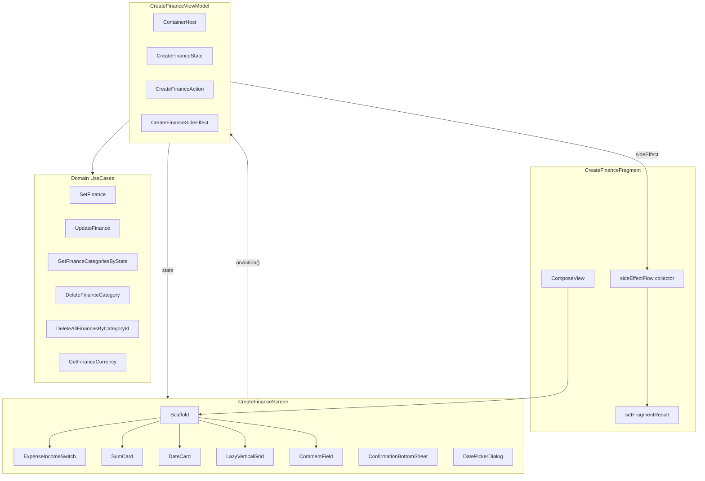

# Migrate CreateFinanceFragment to Compose + Orbit MVI

## Context

Current: [CreateFinanceFragment.kt](app/src/main/java/com/breckneck/debtbook/finance/create/CreateFinanceFragment.kt) (361 lines) + [CreateFinanceViewModel.kt](app/src/main/java/com/breckneck/debtbook/finance/create/CreateFinanceViewModel.kt) (192 lines, LiveData) + [FinanceCategoryAdapter.kt](app/src/main/java/com/breckneck/debtbook/finance/create/adapter/FinanceCategoryAdapter.kt) + XML layout [fragment_create_finance.xml](app/src/main/res/layout/fragment_create_finance.xml).

Reference patterns: [CreateGoalsViewModel.kt](app/src/main/java/com/breckneck/debtbook/goal/create/CreateGoalsViewModel.kt) (Orbit MVI), [CreateGoalsScreen.kt](app/src/main/java/com/breckneck/debtbook/goal/create/screen/CreateGoalsScreen.kt), [CreateGoalsFragment.kt](app/src/main/java/com/breckneck/debtbook/goal/create/CreateGoalsFragment.kt) (thin ComposeView host).

---

## 1. Create MVI contracts (State / Action / SideEffect)

**New file:** `finance/create/CreateFinanceState.kt`

```kotlin
data class CreateFinanceState(
    val createFragmentState: CreateFragmentState,
    val financeCategoryState: FinanceCategoryState,
    val financeCategoryList: List<FinanceCategory>,
    val checkedCategoryId: Int?,
    val sum: String,
    val sumError: SumError?,
    val info: String,
    val dateFormatted: String,
    val date: Date,
    val dayInMillis: Long,
    val currency: String,
    val currencyDisplayName: String,
    val financeEdit: Finance?,
    val isDatePickerVisible: Boolean,
    val deleteCategoryDialog: DeleteCategoryDialogState,
    val categoryError: Boolean,
) {
    companion object { fun initial() = ... }
}
```

**New file:** `finance/create/CreateFinanceAction.kt` -- sealed interface with actions: `SumChanged`, `InfoChanged`, `CategoryClick`, `CategoryLongClick`, `SwitchCategoryState`, `DateClick`, `DateSelected`, `DismissDatePicker`, `SaveClick`, `ConfirmDeleteCategory`, `DismissDeleteDialog`, `AddCategoryClick`, `RefreshCategoriesAfterAdd`.

**New file:** `finance/create/CreateFinanceSideEffect.kt` -- sealed interface: `NavigateBack(saved: Boolean)`, `NavigateToAddCategory(state: FinanceCategoryState)`, `Vibrate`.

---

## 2. Rewrite ViewModel with Orbit MVI

**Rewrite:** [CreateFinanceViewModel.kt](app/src/main/java/com/breckneck/debtbook/finance/create/CreateFinanceViewModel.kt)

- Replace `LiveData` with `ContainerHost<CreateFinanceState, CreateFinanceSideEffect>`
- Use `SavedStateHandle` to read fragment arguments (`isEditFinance`, `financeEdit`, `dayInMillis`, `categoryState`)
- `onCreate` block: read args, set `createFragmentState` (CREATE/EDIT), load currency, load categories by state, init date
- `fun onAction(action: CreateFinanceAction)` dispatcher (same pattern as `CreateGoalsViewModel.onAction`)
- Keep same use case injections (`SetFinance`, `UpdateFinance`, `GetFinanceCategoriesByState`, `DeleteFinanceCategory`, `DeleteAllFinancesByCategoryId`, `GetFinanceCurrency`)
- Move validation inline (sum empty/zero check, category selected check)
- On save: `postSideEffect(NavigateBack(saved = true))`
- On delete category: confirm dialog state in `reduce { }`, then execute delete + reload categories
- On switch expense/income: update `financeCategoryState`, reload categories

---

## 3. Create Compose UI

**New file:** `finance/create/screen/CreateFinanceScreen.kt`

Layout structure (matching XML layout):

- `Scaffold` with `DebtBookLargeTopAppBar` (title = "Adding" or "Edit") + `FloatingActionButton` (check icon)
- Scrollable `Column` content:
  - **Switch card** (expense/income toggle) -- only in CREATE mode. Recreate `CustomSwitchView` as a Compose component using `Row` with two styled `Box` sections and animated indicator, matching colors `#e25d56` (expenses) / `#59cb72` (incomes)
  - **Sum + Currency row** -- `OutlinedTextField` + `VerticalDivider` + `TextButton` for currency (like SumCard in CreateGoalsScreen). Currency is read-only (loaded from settings, no picker needed -- unlike goals, finance has no currency picker)
  - **Date card** -- clickable text showing formatted date, opens `DatePickerDialog`
  - **Categories section** (only in CREATE mode) -- `LazyVerticalGrid(columns = Fixed(3))` with category items (emoji on colored card + name below, selection border). Last item = "Add" button. Long click = show delete dialog
  - **Info/Comment field** -- `OutlinedTextField`
- **ConfirmationBottomSheet** for delete category (existing shared component from [ConfirmationBottomSheet.kt](app/src/main/java/com/breckneck/debtbook/core/ui/components/ConfirmationBottomSheet.kt))
- **DatePickerDialog** (M3, like in CreateGoalsScreen)
- Include `@Preview` composables

Category item composable:

- `Card` with background color from `FinanceCategory.color`
- Emoji `Text` from `FinanceCategory.image` (Unicode code point)
- Name `Text` below (localized via `GetFinanceCategoryNameInLocalLanguage`)
- Selected state: filled border; unselected: outline border (M3 `OutlinedCard`/`Card` with border)

---

## 4. Update Fragment as thin Compose host

**Rewrite:** [CreateFinanceFragment.kt](app/src/main/java/com/breckneck/debtbook/finance/create/CreateFinanceFragment.kt)

- `onCreateView`: return `ComposeView` with `DebtBookTheme { CreateFinanceScreen(vm) }` (same as CreateGoalsFragment)
- `onViewCreated`: collect `sideEffectFlow`:
  - `NavigateBack(saved)` -> `setFragmentResult("financeFragmentKey", ...)`, and if edit mode also `setFragmentResult("financeDetailsKey", ...)`, then `onClickListener.onBackButtonClick()`
  - `NavigateToAddCategory(state)` -> `onClickListener.onAddCategoryButtonClick(state)`
  - `Vibrate` -> `onClickListener.onTickVibration()`
- `setFragmentResultListener("createFinanceFragmentKey")` stays in fragment to handle category list refresh (call `vm.onAction(RefreshCategoriesAfterAdd(...))`)
- Keep `OnClickListener` interface for `MainActivity`

---

## 5. Delete adapter and XML

- Delete [FinanceCategoryAdapter.kt](app/src/main/java/com/breckneck/debtbook/finance/create/adapter/FinanceCategoryAdapter.kt) and the `adapter/` package
- Delete [fragment_create_finance.xml](app/src/main/res/layout/fragment_create_finance.xml) (verify no other references)
- `item_finance_category.xml` -- check if referenced elsewhere; if only by this adapter, delete it
- `dialog_are_you_sure.xml` -- keep (still used by other fragments)

---

## 6. Update documentation

- Update [APP_FINANCE_FEATURE.md](.cursor/docs/APP_FINANCE_FEATURE.md) with new file structure (CreateFinanceState, CreateFinanceAction, CreateFinanceSideEffect, screen/CreateFinanceScreen)

---

## Architecture diagram




